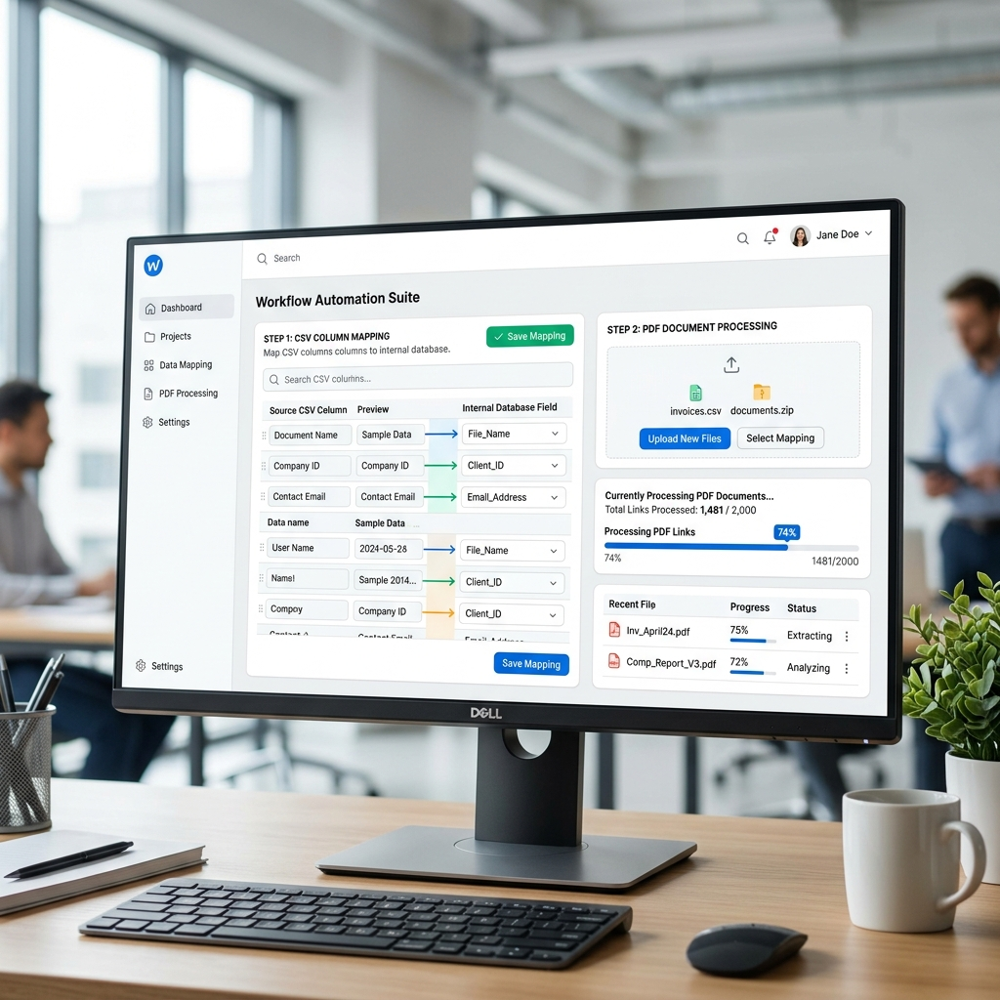

# BR_TS CSV Mapping & PDF Processing Dashboard

A comprehensive web application for mapping CSV data headers to template keys and processing batch operations like PDF parsing and link handling.

## Features

- **CSV Mapping Interface**: Easily map external CSV headers to internal system template fields.
- **Auto-Detection**: Automatically detects specific lender configurations like "Abhiyan" based on the uploaded data.
- **Batch Processing**: Track the progress of large batches (e.g., merging or fetching documents) with real-time UI updates (e.g., "90/120 links processed").
- **Dynamic Theming**: Responsive interface designed with a clean, light theme by default for better visibility.

## Usage Overview

Below is an overview of the dashboard interface where you can manage mappings and track the status of batch processes:



## Installation & Setup

### Prerequisites
- Node.js (v16+)
- npm or yarn
- Java (for the `BR_TS_java` backend services)

### Steps

1. **Install Frontend Dependencies:**
   ```bash
   cd frontend
   npm install
   npm run dev
   ```

2. **Install Backend Dependencies:**
   ```bash
   cd backend
   npm install
   npm run dev
   ```

3. **Start Java Backend (if needed):**
   ```bash
   cd BR_TS_java
   # Run through your IDE or using maven/gradle based on your setup
   ```

## Getting Started
- Upload your CSV file through the main mapping interface.
- Validate and adjust the automatically suggested mappings.
- Save the template configuration. It will be persisted for future sessions.
- Monitor processing progress in the status bar (e.g., "Merging Loading Animation").
